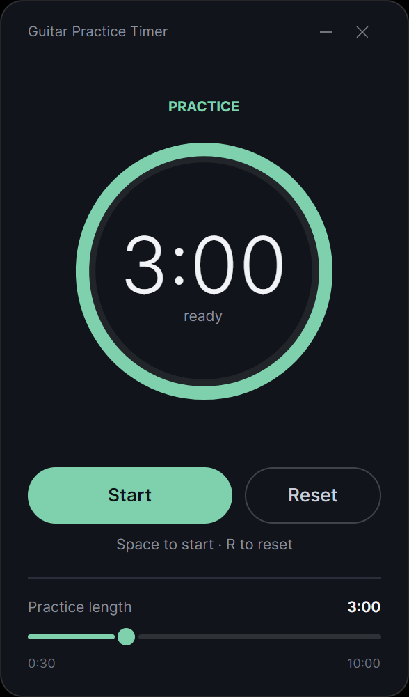
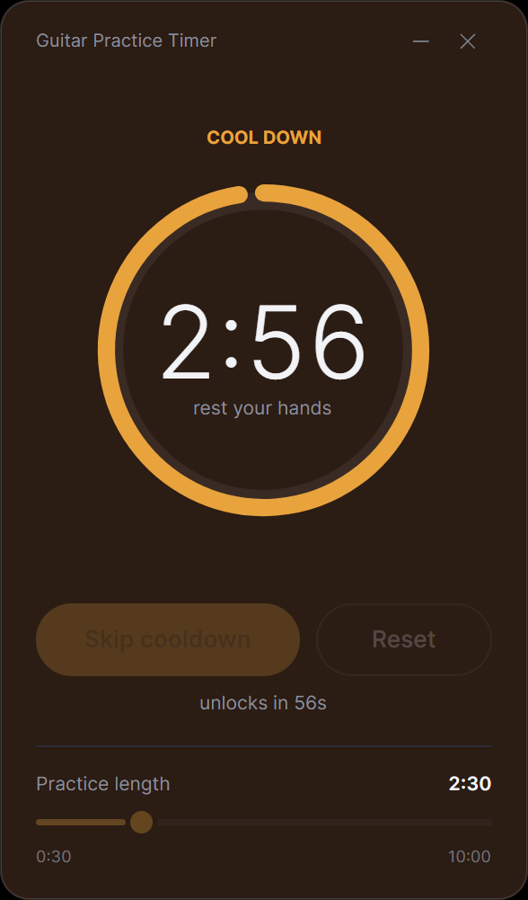

# Guitar Practice Timer

[](https://github.com/Baracuda011/GuitarPracticeTimer/actions/workflows/build.yml)
[](LICENSE)
[](https://dotnet.microsoft.com/download)
[](#platform-support)

**A practice tool for guitarists.** It breaks your session into short, focused
blocks of playing separated by real rest — the structure that learning research
says gets you further than grinding a passage for an hour straight.

Work a lick, a scale shape, a bar of a solo. When the block ends the app plays a
two-note chime, the window fades from cool mint to warm amber, and a
**three-minute break starts automatically** — one you can't skip out of for the
first minute. That locked minute is the whole design. Left to ourselves,
mid-flow, we skip the break every time. The research says the break is where a
lot of the improvement actually shows up.

Built with [Avalonia](https://avaloniaui.net/) on .NET 10. No installer, no
settings file, no telemetry, and no network code of any kind. One window, one
binary.

**[guitar practice timer website →](https://baracuda011.github.io/GuitarPracticeTimer/)**

| Practice | Cool down |
| --- | --- |
|  |  |

---

## Platform support

| Platform | Status |
| --- | --- |
| **Windows 10/11 (x64)** | Supported — built and tested in CI |
| **Linux (x64)** | Supported — built and tested in CI |
| **Android** | In progress |
| **iOS / iPadOS** | Planned |
| **macOS** | Avalonia supports it; not yet built or tested here |

The timer logic lives in a shared, UI-free `Core` project, and the Avalonia view
in a shared `Ui` project, so the mobile builds reuse both rather than
reimplementing the rules. Anything that makes the cooldown hard to escape is
implemented once, in `Core`, and covered by tests.

## How to practise with it

The app is built around one loop, repeated:

1. **Pick one small thing.** A four-bar phrase, a chord change, one scale
   position, a tricky bit of picking. Not "practise the song."
2. **Set a short block.** 30 seconds to 10 minutes; the default is 3 minutes.
   Short is deliberate — the goal is many focused reps of one thing, not
   endurance.
3. **Play it, repeatedly, for the whole block.** Slowly enough to get it right.
4. **When the chime sounds, put the guitar down.** The window turns amber. Do
   not keep noodling — see the science below; playing something else through the
   break measurably eats into the gain.
5. **Come back and run it again.** The app returns to practice mode paused at
   your chosen length, so the next block is always a deliberate decision.

The next block is usually the interesting one. It is very common for a passage
to come back cleaner after the break than it was when you put the guitar down.

## The science behind it

The design follows a specific, well-replicated finding: during early skill
learning, **a large share of the improvement appears across the short rest
periods between practice attempts, not during the practice itself.**

### The primary source

> Bönstrup, M., Iturrate, I., Thompson, R., Cruciani, G., Censor, N., &
> Cohen, L. G. (2019). **A Rapid Form of Offline Consolidation in Skill
> Learning.** *Current Biology*, 29(8), 1346–1351.
> [doi:10.1016/j.cub.2019.02.049](https://doi.org/10.1016/j.cub.2019.02.049)
> · [full text](https://www.cell.com/current-biology/fulltext/S0960-9822(19)30219-2)

Leonardo Cohen's lab at the US National Institute of Neurological Disorders and
Stroke (NINDS) had participants learn a five-element finger-tapping sequence
with their non-dominant hand — the closest a lab gets to drilling a guitar lick.
Practice was structured as **36 trials of 10 seconds playing, 10 seconds rest**,
about 12 minutes in total, recorded under magnetoencephalography (MEG).

Splitting the learning curve into *micro-online* gains (improvement within a
10-second practice bout) and *micro-offline* gains (improvement across a
10-second rest), they found that **early learning was accounted for almost
entirely by the offline gains across rest** — people came back from each short
break faster than they left it, while performance within a bout was flat or
declining. Frontoparietal beta oscillations during rest predicted the size of
each break's gain, consistent with the brain rehearsing the sequence while the
hands were still. It put memory consolidation, previously discussed on a scale
of hours or a night's sleep, on a scale of **seconds**.

The same group replicated it at scale — 389 participants online plus an in-lab
group — in [Bönstrup et al. (2020), *npj Science of Learning*](https://doi.org/10.1038/s41539-020-0066-9).

### The music-specific study

> Simmons, A. L., Allen, S. E., Cash, C. D., & Duke, R. A. (2019). **Effects of
> early break intervals on musicians' and nonmusicians' skill learning.**
> *Psychology of Music*, 47(1), 83–95.
> [doi:10.1177/0305735617735373](https://doi.org/10.1177/0305735617735373)

Closer to home: 118 participants — 59 music majors, 59 non-musicians — learned a
five-element keypress sequence on a **digital piano** in a 12-minute session, with
a 5-minute break part way through. What they did *during* the break was varied.

The result that matters for how you use this app: participants who **practised a
different motor sequence** during the break made **significantly smaller gains
across it** than those who chatted with the proctor or memorised word pairs. A
competing motor task ate the benefit.

In guitar terms: when the break starts, actually stop playing. Don't switch to
warming up something else, don't drift into noodling. Put the guitar down.

### An honest caveat

This is live science, not settled fact. A 2025 paper —
[Das et al., *PNAS*, doi:10.1073/pnas.2509233122](https://doi.org/10.1073/pnas.2509233122)
— argues the micro-offline gains reflect recovery from fatigue and pre-planning
of the next attempt rather than genuine offline consolidation, and reports that
break and no-break groups reached similar skill levels on later tests. Note what
is and isn't disputed: **nobody disputes that you perform better coming out of a
break.** The argument is about the mechanism.

Two other honest notes:

- The strongest evidence is at the **seconds** timescale — 10 seconds of rest
  between 10 seconds of practice. This app enforces a **three-minute** break
  after a multi-minute block. That's an extrapolation, sitting closer to the
  distributed-practice literature and the 5-minute break in the Simmons study
  than to the Bönstrup design.
- The three-minute break also does a second, entirely non-controversial job:
  it gets your hands off the neck. Repetitive strain is a real way guitarists
  lose months, and no study is needed to justify unclenching your fretting hand
  every few minutes.

**Sources:** [Bönstrup et al. 2019, *Current Biology*](https://www.cell.com/current-biology/fulltext/S0960-9822(19)30219-2)
· [Bönstrup et al. 2020, *npj Science of Learning*](https://pmc.ncbi.nlm.nih.gov/articles/PMC7272649/)
· [Simmons et al. 2019, *Psychology of Music*](https://doi.org/10.1177/0305735617735373)
· [Das et al. 2025, *PNAS*](https://pmc.ncbi.nlm.nih.gov/articles/PMC12595466/)
· [NINDS press release](https://www.ninds.nih.gov/news-events/news/press-releases/want-learn-new-skill-take-some-short-breaks)

## Features

- **Adjustable practice block** — 30 seconds to 10 minutes, in 10-second steps.
- **Enforced 3-minute break** — starts on its own the moment a block ends.
- **60-second skip lock** — the break can't be cut short until a minute has
  passed, and the button shows exactly how long is left.
- **Audible end-of-block cue** — a two-note chime (G5 → C6), so you can keep your
  eyes on the fretboard instead of the clock.
- **Full-window colour shift** — practice is a cool dark mint, break is a warm
  amber, crossfading over 550 ms. Readable across the room, out of the corner of
  your eye, mid-phrase.
- **Circular progress dial** — an arc sweeping clockwise from 12 o'clock as the
  block drains.
- **Drift-free timing** — the timer stores a UTC deadline and subtracts from it
  rather than accumulating ticks, so it stays accurate even if the UI thread
  stutters, and survives an OS suspending the app.
- **Keyboard driven** — start, pause and reset without putting the guitar down.
- **Frameless window** — rounded custom chrome with a drop shadow; drag anywhere
  on the card to move it. Small enough to sit beside a tab or a score.

## Keyboard shortcuts

| Key     | Action                                                  |
| ------- | ------------------------------------------------------- |
| `Space` | Start / Pause / Resume — or skip the break once unlocked |
| `R`     | Reset to the full block length (ignored during a break)  |
| `Esc`   | Close the app                                            |

## What the app does, screen by screen

1. **Ready** — drag the slider to pick a block length. The dial and the label
   below the slider both update as you drag.
2. **Playing** — hit Start or `Space`. The slider locks so the block can't shift
   under you, and the arc unwinds.
3. **Chime** — the block hits zero, the two-note cue plays, and the window turns
   amber on its own.
4. **Cool down** — three minutes, "rest your hands". **Skip cooldown** is
   disabled for the first 60 seconds and the hint line counts down to the
   unlock; **Reset** and the slider are dead for the whole break.
5. **Back to ready** — whether you skip or wait it out, the app returns to
   practice mode, reset to your slider length and **paused**.

## Install

Download the latest build from the
[Releases page](https://github.com/Baracuda011/GuitarPracticeTimer/releases):

| Platform | File | Run it with |
| --- | --- | --- |
| Windows | `…-win-x64.zip` | extract, then `GuitarPracticeTimer.exe` |
| Linux | `…-linux-x64.tar.gz` | extract, then `./GuitarPracticeTimer` |

Nothing to install and no .NET runtime to fetch first — everything is bundled
into the one binary.

### Verifying your download

Releases are built by GitHub Actions, not on a developer's machine, and carry a
signed provenance attestation tying the binary to the exact source it came from:

```bash
gh attestation verify GuitarPracticeTimer-*-win-x64.zip \
  --repo Baracuda011/GuitarPracticeTimer
```

Every release also ships `SHA256SUMS.txt`:

```bash
sha256sum -c SHA256SUMS.txt            # Linux
Get-FileHash *.zip -Algorithm SHA256   # Windows
```

On first run Windows may ask you to confirm before opening a program it hasn't
seen many people run yet — *More info* → *Run anyway*. That prompt reflects how
widely a program has been downloaded, not anything found inside it.

## Requirements

- [.NET 10 SDK](https://dotnet.microsoft.com/download) to build
  *(published binaries are self-contained and need no runtime installed)*
- Python 3 — **only** to regenerate the icon or the chime

## Build and run

```bash
git clone https://github.com/Baracuda011/GuitarPracticeTimer.git
cd GuitarPracticeTimer
dotnet run --project src/GuitarPracticeTimer.Desktop
```

Run the tests:

```bash
dotnet test
```

### Publishing a standalone binary

```bash
dotnet publish src/GuitarPracticeTimer.Desktop -c Release -r win-x64   -o publish/win-x64
dotnet publish src/GuitarPracticeTimer.Desktop -c Release -r linux-x64 -o publish/linux-x64
```

Size settings live in
[`GuitarPracticeTimer.Desktop.csproj`](src/GuitarPracticeTimer.Desktop/GuitarPracticeTimer.Desktop.csproj)
and apply automatically whenever a runtime identifier is supplied: self-contained,
single-file, trimmed and compressed. Trimming matters — it takes the executable
from 82 MB to under 14 MB, with a full payload of about 32 MB including the
native Skia and audio libraries.

### Regenerating the generated assets

Two assets are generated from scratch by scripts using **only the Python
standard library** — no Pillow, no numpy, no ImageMagick:

```bash
python make_icon.py     # Assets/app.ico   — 16 to 256 px, hand-built PNG + ICO
python make_chime.py    # Assets/chime.wav — G5 → C6, enveloped, 0.5 s
python verify_assets.py # checks both still match their generators
```

CI runs `verify_assets.py` on every push. It compares the icon by **decoded
pixels** rather than by bytes, because PNG data is zlib-compressed and zlib's
output differs between versions — the same icon is 8142 bytes on one Python and
8005 on another. The chime is compared byte for byte, which it can be because
WAV is uncompressed.

## Project structure

```
GuitarPracticeTimer/
├── src/
│   ├── GuitarPracticeTimer.Core/      Timer rules, dial maths, palette — no UI framework
│   │   ├── PracticeSession.cs         State machine; every cooldown rule lives here
│   │   ├── SessionView.cs             One frame of display state
│   │   ├── DialGeometry.cs            Arc maths, framework-free
│   │   └── Palette.cs                 The two colour schemes
│   ├── GuitarPracticeTimer.Ui/        Shared Avalonia UI, reused by every platform
│   │   ├── TimerViewModel.cs          Drives the view from Core
│   │   ├── Views/TimerView.axaml      Dial, buttons, slider
│   │   └── Audio/Chime.cs             Cross-platform playback via miniaudio
│   └── GuitarPracticeTimer.Desktop/   Window chrome, drag, keyboard shortcuts
├── tests/
│   └── GuitarPracticeTimer.Core.Tests/  33 tests, mostly on the cooldown rules
├── docs/                              The website (GitHub Pages) and screenshots
├── Assets/                            app.ico and chime.wav, both generated
├── make_icon.py, make_chime.py, verify_assets.py
└── .github/workflows/                 CI matrix, and releases with attestation
```

Dependencies: Avalonia for the UI and [SoundFlow](https://github.com/LSXPrime/SoundFlow)
for audio. `Core` has none at all.

## Customising it

Most of what you'd want to change is a constant or two. If you want to sit
closer to the Bönstrup protocol, try a 20–30 second block with a 15 second
break; for repertoire work, longer blocks with the full 3 minutes.

| What | Where | Default |
| --- | --- | --- |
| Break length | `CooldownTotalSeconds` in [`PracticeSession.cs`](src/GuitarPracticeTimer.Core/PracticeSession.cs) | `180` s |
| Skip lock duration | `CooldownLockSeconds` in [`PracticeSession.cs`](src/GuitarPracticeTimer.Core/PracticeSession.cs) | `60` s |
| Practice range and step | `MinDurationSeconds` / `MaxDurationSeconds` / `DurationStepSeconds` | 30–600 s, 10 s |
| Default block length | `DefaultDurationSeconds` | `180` s |
| Mode colours | [`Palette.cs`](src/GuitarPracticeTimer.Core/Palette.cs) | mint / amber |
| Fade duration | `FadeDuration` in [`Palette.cs`](src/GuitarPracticeTimer.Core/Palette.cs) | `550` ms |
| Chime pitch and length | `G5` / `C6` / `NOTE_ONE` / `NOTE_TWO` in [`make_chime.py`](make_chime.py) | 784 Hz → 1047 Hz |

If you change the slider range, update the `0:30` / `10:00` end labels in
[`TimerView.axaml`](src/GuitarPracticeTimer.Ui/Views/TimerView.axaml) to match,
and the `Duration` tests in `PracticeSessionTests.cs`.

## Implementation notes

A few decisions that aren't obvious from a skim:

- **The rules live in one place.** `PracticeSession` holds the entire state
  machine with no UI framework attached, so desktop and mobile cannot drift on
  the one behaviour the app exists to enforce. It is the most heavily tested
  part of the codebase for exactly that reason.
- **Deadline, not accumulation.** `_deadlineUtc` is set once when the timer
  starts; every tick just measures how far away it still is. A dropped frame
  costs display smoothness, never accuracy — and on mobile, where the OS
  suspends apps outright, a session resumed after a long gap recomputes
  correctly instead of losing the ticks it never received.
- **Colour changes are transitions, not animations.** Avalonia has no
  equivalent of animating a shared unfrozen brush, so each surface declares a
  `BrushTransition` and the view model simply assigns a new brush. One
  assignment repaints the whole window over 550 ms.
- **The dial is drawn, not composed.** `BuildArc` emits a `StreamGeometry` with
  a single `ArcTo`, picking the large-arc flag past 180°, and clamps the sweep
  just short of a full turn so a completed circle doesn't collapse to a
  zero-length path.
- **The chime is a generated file.** `Console.Beep` is Windows-only and throws
  everywhere else, so the two notes are synthesised into a WAV by
  `make_chime.py` and played through miniaudio. Every failure path is swallowed
  on purpose: on a machine with no working audio the colour change is still a
  complete signal.
- **Title-bar glyphs are vector paths.** The original used Segoe MDL2 Assets,
  which exists only on Windows and would render as empty boxes on Linux.

## Roadmap ideas

Not implemented, but natural next steps for a practice tool:

- **Android and iOS builds** on the shared `Core` and `Ui` projects
- **Practice log** — blocks completed per day, and what you worked on
- **Named drills** — label the block ("Am pentatonic, position 3") and keep a history
- **Configurable long break** after N blocks
- **A metronome pane**, with the tempo recorded alongside each block
- Remembering the last-used block length between runs
- Always-on-top toggle, for practising alongside tab on screen

## Contributing

Contributions are welcome, with one standing caveat: **the enforced break stays
enforced.** A PR adding a way to switch the cooldown off is the one change that
won't be merged — it's the entire point of the app.

- [Contributing guidelines](CONTRIBUTING.md) — scope, setup, and what to check
  before opening a PR
- [Code of conduct](CODE_OF_CONDUCT.md)
- [Security policy](SECURITY.md) — please report vulnerabilities privately
- [Changelog](CHANGELOG.md)

Every push and pull request is built and tested on **both Windows and Linux**
with warnings treated as errors, and CI re-runs the asset generators to confirm
the committed icon and chime still match them.

## Support

The app is free and stays free. If it has made your practice better, there are
[a few ways to support it](https://baracuda011.github.io/GuitarPracticeTimer/#support)
— and if not, please just enjoy it.

## Licence

[MIT](LICENSE) — do what you like with it, including using it to actually
practise.

The research cited in [The science behind it](#the-science-behind-it) belongs to
its respective authors and publishers; the citations are provided so you can
check the claims yourself, and none of those authors are affiliated with or
endorse this app.
